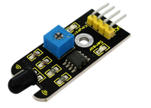
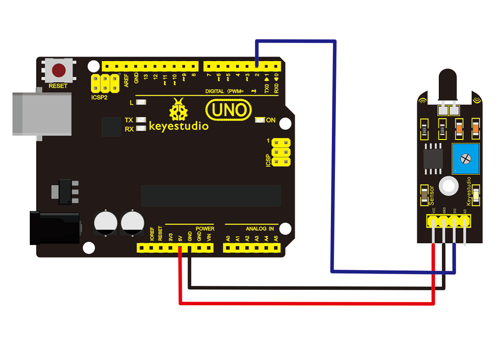

# KS0036 keyestudio Flame Sensor



## 1. Introduction

This flame sensor can be used to detect fire or other lights with wavelength stands at 760nm ~ 1100nm.

In the fire-fighting robot game, the flame plays an important role in the probe, which can be used as the robot's eyes to find fire source.

## 2.Specification

- Supply Voltage: 3.3V to 5V
- Detection Range: 20cm (4.8V) ~ 100cm (1V)
- Rang of Spectral Bandwidth: 760nm to 1100nm
- Operating Temperature: -25℃ to 85℃
- Interface: Digital

## 3. Connection Diagram

Connect the D0 pin to digital 2, GND pin to GND port, VCC pin to 5V port.



## 4. Sample Code

Download code: [Code](./Code.7z)

```c
const int flamePin = 2;     // the number of the flame pin
const int ledPin =  13;      // the number of the LED pin
// variables will change:
int State = 0;         // variable for reading status

void setup() 
{
  // initialize the LED pin as an output:
  pinMode(ledPin, OUTPUT);      
  // initialize the pushbutton pin as an input:
  pinMode(flamePin, INPUT);     
}

void loop()
{
    // read the state of the value:
	State = digitalRead(flamePin);
    if (State == HIGH) 
    {     
        // turn LED on:    
        digitalWrite(ledPin, HIGH);  
    } 
  	else
  	{
        // turn LED off:
        digitalWrite(ledPin, LOW);
    }
}
```

## 5. Result

Done wiring and powered up, upload well the code to the board.


Then if you put a lighter close to the sensor, when the sensor detects the flame, another led on the sensor is turned on.

